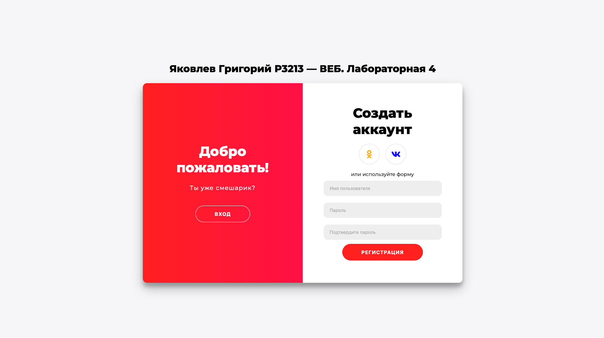

# web-programming
Курс веб-программирования Университета ИТМО. Краткое описание каждой лабораторной работы и технологий используемых в ней.

## lab1
Разработать PHP скрипт определяющий попадание в область, форму с валидацией значений, таблицу с результатами запросов.

Серверная часть — PHP.
Валидация и отправка — JS.

## lab2
Разработать веб-приложение на базе сервлетов и JSP, определяющее попадание точки на координатной плоскости в заданную область.

Серверная часть — Java Servlet.
Веб — JSP, JSTL.

## lab3
Разработать приложение на базе JavaServer Faces Framework, которое осуществляет проверку попадания точки в заданную область на координатной плоскости.

Серверная часть — JavaEE, JDBC.
Веб — JSF, PrimeFaces.

## lab4
Разработать приложение: back-end должен быть основан на Spring, front-end должен быть построен на React + Redux. Взаимодействие между уровнями back-end и front-end должно быть организовано посредством REST API. Приложение должно включать в себя 2 страницы - стартовую и основную страницу приложения. Обе страницы приложения должны быть адаптированы для отображения в 3 режимах: десктопный, планшетный, мобильный.

Серверная часть — Spring Core, Boot, Data, Security.
Веб — React, Redux.

Доп: авторизация через Вконтакте и Одноклассники. OAuth2.

